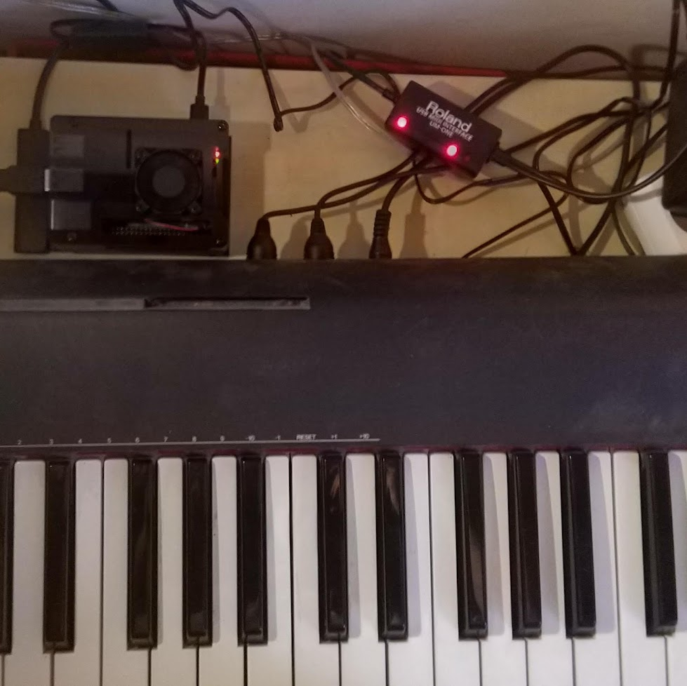
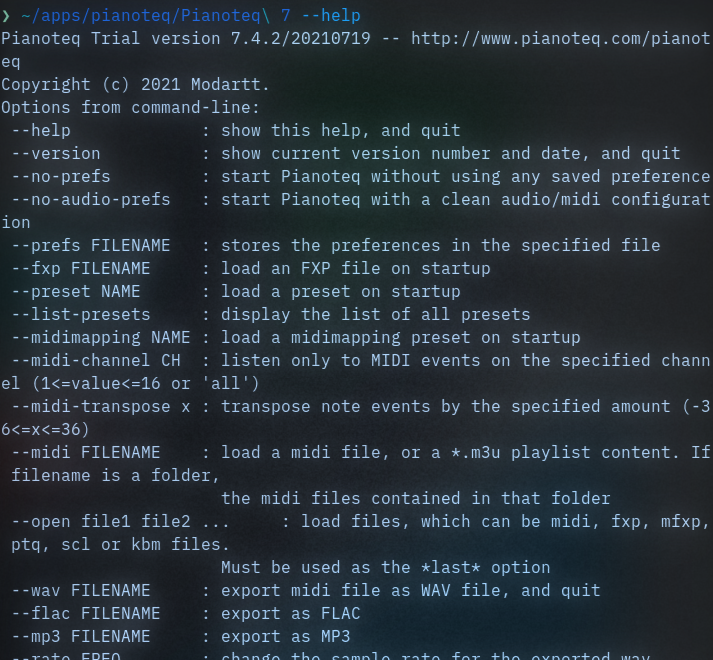

---
created: 2021-07-31
made with: [go, raspberry pi]
tags: [program, hardware, automation]
wip: yes
layout:
	- p
	- m
	- p
	- p
	- p
	- p
	- [m, p]
	- p
	- l
----

# midibackup

:: fr

Un programe enregistrant toute activité MIDI d'un clavier dans des fichiers .midi

Il m'arrive souvent d'avoir soudainement une idée de mélodie, et de la réaliser spontanéement à mon piano dans ma chambre.
Cependant, voilà que je viens de passer 10 minutes d'improvisation qui seront perdues: je n'ai pas pris le temps de démarrer un enregistrement!

Mais, heureusement, mon piano possède des entrées et sorties MIDI, et j'ai récemment fait l'acquisition d'une Raspberry Pi 4.

Ainsi, en branchant mon piano à celle-ci, et grâce à ce programme, il m'est possible de ne perdre aucune idée. Ce projet a les mêmes motivations et est similaire dans son objectif à [ideaseed](/ideaseed), mais se focalise plus sur des idées purement musicales, rarement exprimables par du texte.

Concrètement, le programme s'appuie en large partie sur _arecordmidi_, un programe en ligne de commande Linux qui permet de lister les appareils éméttant du MIDI, et d'enregistrer.
Mon programe enregistre continuellement des fichiers .midi. Un fichier est sauvegardé avec une intervalle de temps configurable, les fichiers vide sont supprimés et ceux ayant du contenu sont fusionnés, puis scindés de nouveau en fonction de la présence de silence dans le fichier lui-même.

En outre, l'excellent piano virtuel basé sur de la modélisation physique, _[Pianoteq 7](https://modartt.com/pianoteq)_, offre une interface de ligne de commande, ce qui permet de convertir les fichiers .midi en fichiers audio jouables sans aucune interaction avec l'utilisateur, pour ainsi obtenir sans aucun effort des aperçus de très haute qualité de mes enregistrements afin de pouvoir les écouter et les trier ultérieurement.

Je prévois d'ajouter un système de notation a posteriori qui me permettrait de décider si ce que je viens d'improviser vaut la peine d'être conservé et, dans ca cas, quelle importance lui donner, potentiellement via une interface utilisateur physique sur la Raspberry Pi.

[Code source](https://github.com/ewen-lbh/midibackup)

:: en

Listen continuously for MIDI input from your keyboard and save any session you make into a .midi

It often happens that I suddenly have an idea for a melody, and spontaneously play it on the piano in my room.
However, here I am, having spent 10 minutes of improvisation that will be lost: I did not take the time to start a recording!

But, fortunately, my piano has MIDI inputs and outputs, and I recently acquired a Raspberry Pi 4.

So, by connecting my piano to it, and thanks to this program, it is possible for me not to lose any idea. This project has the same motivations and is similar in its goal to [ideaseed](/ideaseed), but focuses more on purely musical ideas, rarely expressable by text.

Concretely, the program relies largely on _arecordmidi_, a Linux command line program which allows to list MIDI emitting devices, and to record from them.
My program continuously records .midi files. A file is saved with a configurable time interval, empty files are deleted and those with content are merged, then split again depending on the presence of silence in the file itself.

Furthermore, the excellent physical-modeling-based software piano _[Pianoteq 7](https://modartt.com/pianoteq)_ provides a first-party command-line interface to render .midi files into playable audio files without any user interaction, so this is also used to give me high-quality previews of my recordings so that I can listen and sort through them later.

I plan to add an after-the-fact scoring system where I could decide if what I just improvised is worth keeping and, if it is, in which importance pile to stash it on, maybe through a physical user interface on the Raspberry Pi.

[Source code](https://github.com/ewen-lbh/midibackup)
